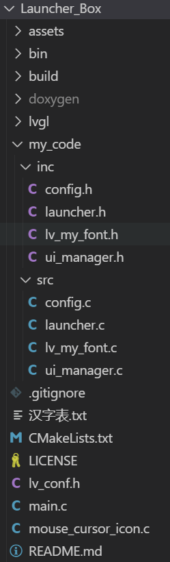

# Launcher_Box

## 简介

Launcher Box 是 GEC6818 嵌入式平台基于LVGL的应用启动器，支持多项目集成和管理，是一个轻量级的应用程序启动器，用于管理和快速启动多个项目。它提供了一个简洁的用户界面，允许用户浏览项目列表、查看项目描述，并一键启动选定的项目。适用于需要管理多个独立应用程序或工具的场景。

## 功能特性

- 扫描指定目录下的项目
- 显示项目名称和描述信息
- 一键启动选定的项目
- 友好的用户界面
- 支持并发控制，防止重复启动

## 流程图

###### 

## 安装说明

### 依赖项

确保系统已安装以下依赖：
- 例如: GEC6818开发板
- Linux 系统
- GCC 编译器
- LVGL 图形库
- POSIX 信号量支持

### 编译安装

1. 克隆仓库：
   ```bash
   git clone https://github.com/Juechen18/Launcher_Box.git
   cd Launcher_Box
   ```

2. 编译项目：
   ```bash
   rm -rf build
   mkdir build
   cd build
   cmake ..
   make -j
   ```
   
3. 开发版上对应目录运行：
   ```bash
   ./Launcher_Box/launch
   ```

## 使用指南

### 快速开始

1. 确保项目目录结构正确：

   


2. 运行 Launcher Box：
   ```bash
   ./Launcher_Box/launcher
   ```

3. 使用界面：
   - 左侧列表选择项目
   - 右侧查看项目详情
   - 点击"启动"按钮运行项目

### 配置选项

可以通过修改 `config.h` 文件中的 `PROJECTS_DIR` 宏定义来更改项目目录：
```c
#define PROJECTS_DIR "/path/to/your/projects"
例如
	#define PROJECTS_DIR "/root/jc/Launcher_Box/projects"
	#define PROJECTS_DIR "./projects"
```

## 贡献指南

欢迎贡献！请遵循以下步骤：

1. Fork 项目仓库
2. 创建特性分支 (`git checkout -b feature/your-feature`)
3. 提交更改 (`git commit -m 'Add some AmazingFeature'`)
4. 推送到分支 (`git push origin feature/your-feature`)
5. 提交 Pull Request

### 代码风格

- 遵循 Linux 内核编码风格
- 使用 4 空格缩进
- 函数和变量使用小写加下划线命名法
- 所有公共 API 必须有 Doxygen 注释


## 常见问题

### Q: 项目启动失败怎么办？
A: 请检查：
1. 开发板项目目录下是否有可执行的 `main` 文件
2. `main` 文件是否有执行权限 (`chmod +x main`)
3. 描述文件 `desc.txt` 是否存在

### Q: 如何添加新项目？
A: 只需在项目目录下创建一个新文件夹，包含可执行文件和描述文件即可。

## 联系信息

- 维护者: [Juechen18](https://github.com/Juechen18)
- 邮箱: 1958509626@qq.com
- 问题跟踪: [GitHub Issues](https://github.com/Juechen18/Launcher_Box/issues)

## 许可证

本项目采用 MIT 许可证授权 - 详情请参阅 [LICENSE](LICENSE) 文件。
